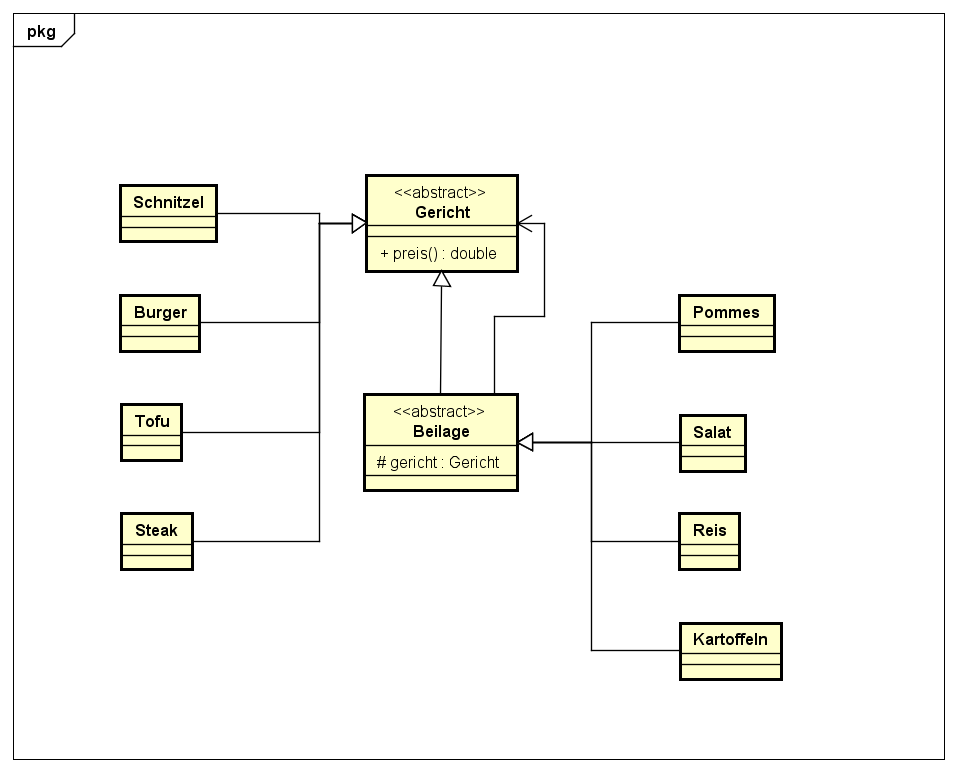

# Decorator Pattern

### Wozu dient das Decorator Pattern?

Das Decorator Pattern verhindert die "Klassenexplosion". Was ist 
hier gemeint? Das Decorator Pattern fügt einem Object dynamisch 
erweiterungen hinzu, anstatt tausende einzelne Klassen zu haben.

Betrachten wir mal als Beispiel ein Restaurant.

Das Restaurant xy bietet als Hauptspeisen Schnitzel, Burger, Tofu 
und Steak an, als Beilage gibt es entweder Pommes, Reis, Salat oder
Kartoffeln. Jetzt könnte man für jede einzele Kombination eine Klasse
erstellen zB. SchnitzelMitPommes, SchnitzelMitSalat, BurgerMitPommes, ...
Dies würde aber schnell in einer unübersichtlichen Anzahl an Klassen enden.

Abhilfe bietet hier das Decorator Pattern, es ermöglicht einem ein
Hauptgericht mit Beilage zusammen zu stellen ohne, dass man hierfür
für jede möglichkeit eine eigene klasse benötigt.


### Wie funktionert das Decorator Pattern?

Zu erst brauchen wir eine abstracte Klasse Gericht, welche dann Beilage
und Hauptgericht zusammenfasst. Danach erstellen wir die einzelnen Klassen 
der Hauptgerichte welche von der Hauptklassse Gericht erbt. Dann erstellen
wir die abstracte Klasse Beilage, von der Klasse beilage erben dann die
Unterklassen wie zum Beispiel Pommes oder Salat.

Wenn man jetzt den Preis seines Gerichts wissen möchte muss man nur die
preis() Methode des "obersten" Objekts aufrufen, welches dann seinen Preis
und den Preis der aller Attribute zurück liefert.

### UML



### Code

Als erstes müssen zwei abstrakte Klassen erstellt werden:

* Die Gericht Klasse mit der abstrakten methode preis()
* Die Beilage Klasse die eine Subklasse von Geraenk ist

```java

public abstract class Gericht{
	public abstract double preis();
}

public abstract class Beilage extends Gericht{
    protected Gericht gericht;
}
```

Dann werden die eigentlichen Gerichte und Beilagen implementiert

```java

public class Schnitzel extends Gericht{
    @override
	public double preis(){
		return 7.90;
	}
}

public class Steak extends Gericht{
    @override
	public double preis(){
		return 19.90;
	}
}


public class Pommes extends Beilage{
	private Gericht gericht;

	public Pommes(Gericht gericht){
		this.gericht = gericht;
	}

    @override
	public double preis(){
		return this.gericht.preis() + 1.20;
	}
}

public class Reis extends Beilage{
	private Gericht gericht;

	public Pommes(Gericht gericht){
		this.gericht = gericht;
	}

    @override
	public double preis(){
		return this.gericht.preis() + 2.20;
	}
}
```

Letztens können die verschiedenen Gerichte erstellt werden

```java

public class Main{
	public static void main(String[] args){
		Gericht gericht = new Pommes(new Schnitzel());
		Gericht gericht = new Reis(new Reis(new Steak()));
	}
}
```