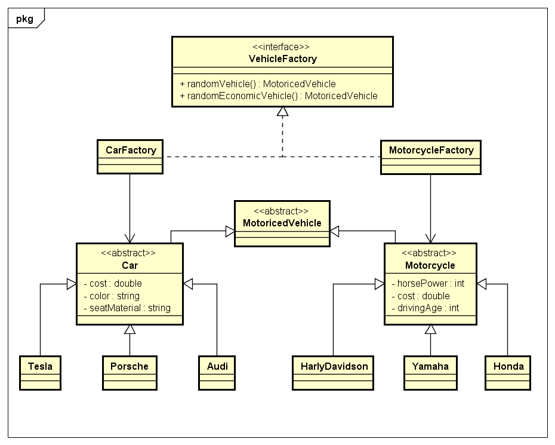

### Wozu dient das Factory Pattern?
Durch das "Problem" mit 'new' ist die abänderbarkeit, da wir dadurch
auf einer Implementierung Programmierung.

Das new Statment wird auf eine eigene Klasse ausgelegt um den ersten
Grundsatz der Design Patterns einzuhalten (Trennen von veränderbaren,
und unveränderbaren)


# Factory Method

Es wird ein Interface CarFactory erstellt, welches eine createCar
Methode erfordert. Dieses Interface wird dann von 2 Factory
Klassen implementiert.
* RandomCarFactory: erstellt ein zufälliges Auto
* EconomicCarFactroy: erstellt ein economisch freundliches Auto

### UML


### Code
```java
public interface CarFactory(){
    public Car createCar();
}
```

```java
public class RandomCarFactory implements CarFactory{
    @Override
    public Car createCar(){
        int random = (int) Math.random()*3

        if(random == 3){
            return new Tesla;
        }else if(random == 2){
            return new Porsche;
        }else{
            return new Audi;
        }
    }
}
```

```java
public class EconomicCarFactory implements CarFactory{
    @Override
    public Car createCar(){
        /**
        * Liefert automatisch einen Tesla zurück, da er das einzige elektro Autoist
        */
        return new Tesla;
    }
}
```

# Abstract Factory

### UML




### Code
```java
public interface VehicleFactory(){
    public MotoricedVehicle randomVehicle();
    public MotoricedVehicle randomEconomicVehicle();
}
```

```java
public class CarFactory implements VehicleFactory{
    @Override
    public Car randomVehicle(){
        int random = (int) Math.random()*3

        if(random == 3){
            return new Tesla;
        }else if(random == 2){
            return new Porsche;
        }else{
            return new Audi;
        }
    }

     @Override
     public Car randomEconomicVehicle{
        /**
        * Liefert automatisch einen Tesla zurück, da er das einzige elektro Autoist
        */
        return new Tesla;
     }
}
```

```java
public class MotorcycleFactory implements VehicleFactory{
    @Override
    public Motorcycle randomVehicle(){
        int random = (int) Math.random()*3

        if(random == 3){
            return new HarlyDavidson;
        }else if(random == 2){
            return new Yamaha;
        }else{
            return new Honda;
        }
    }

    @Override
     public Motorcycle randomEconomicVehicle{
        /**
        * Liefert automatisch einen Honda zurück, da er das einzige elektro Motorrad
        */
        return new Honda;
     }
}
```