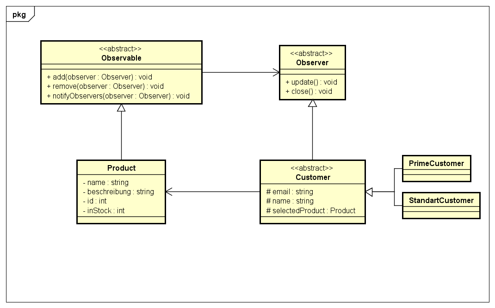

# Observer Pattern

### Wozu dient das Observer Pattern?

Das Observer Pattern dient als "Newsletter", der Sinn des Observer 
Pattern ist, dass alle abhängigen Objekte benachrichtigt werden,
wenn sich der Zustand eines bestimmten Objektes ändert.

Angenommen wir haben auf Amazon einen Gegenstand gefunden der
uns gefällt, doch leider ist er ausverkauft. Da wir den Gegenstand
unbedingt haben wollen melden wir uns über den "Notify Me" Button
an um informiert zu werden, sobald der Gegenstand wieder zur
Verfügung steht.

Diese Benachrichtigung funktioniert mittels eines Observer Patterns.


### Wie funktionert das Observer Pattern?

Hierfür verwendet man ein Objekt names Observable, dieses Objekt
behinhaltet die Gewünschten Daten, in unserem Fall die Information
ob der Gegenstand wieder verfügbar ist, und eine Liste mit allen
Interessenten (alle die "Notify Me" gedrückt haben).

Die Interessenten die dann die Daten vom Observer haben wollen
können sich dann jederzeit beim Observable registrieren, quasi
wie ein Newsletter (in unserem fall mittels dem "Notify Me" Button).


### UML



### Code
Zu erst erstellen wir unsere abstrakten Klassen:

* Die Klasse Observable
* Die Klasse Observer
* Die Klasse Customer

```java
public abstract class Observable{
    // Die Liste der angemeldeten Observer
    protected ArrayList<Observer> observers = new ArrayList();

    /**
     * @param observer der Observer der angemeldet werden soll
     */
    public void add(Observer observer){
        this.observers.add(observer);
    }

    /**
     * @param observer der Observer der abgemeldet werden soll
     */
    public void remove(Observer observer){
        this.observers.remove(observer);
    }

     /**
      * Benachrichtigt die Observer, dass der Gegenstand wieder vorhanden
      */
     public void notifyObservers(){
        for(int x = 0; x < observers.size(); x++){
                observers.get(x).update();
            }
        }
    }
```

```java
public abstract class Observer{

    /**
     * Informiert den Käufer, dass das Produkt wieder vorhanden ist
     */
    public abstract void update();

    /**
     * Meldet den Käufer von der Warteliste ab.
     */
    public abstract void close();
}
```

```java
public abstract class Customer extends Observer{
    protected String email;
    protected String name;
    protected Product selectedProduct;

    public Customer(String email, sting name, Product selectedProduct){
        this.email = email;
        this.name = name;
        this.selectedProduct = selectedProduct;

        this.selectedProduct.add(this);
    }

    public void close(){
        this.selectedProduct.remove(this)
    }

    public void update(){
        System.out.println("Ihr Artikel ist verfügbar");
    }
}

public class PrimeCustomer extends Customer{
    public PrimeCustomer(){
        super();
    }
}
public class StandartCustomer extends Customer{
    public StandartCustomer(){
        super();
    }
}
```

Zum Schluss erstellen wir das Produkt

```java
public class Product extends Observable{
     private String name;
     private String beschreibung;
     private int id;
     private int inStock;

     public Product(){
         this.name = "Test Artikel";
         this.beschreibung = "Ich bin eine Beschreibung";
         this.id = 1337;
         this.inStock = 0;
     }

     public String getName(){
         return this.name;
     }

     public String getBeschreibung(){
         return this.beschreibung;
     }

     public int getID(){
        return this.id;
     }

     public int getInStock(){
       return this.inStock;
     }
}
```

Jetzt können wir die Main Methode schreiben

```java
public class Main{
    public static void main(String[] args){
        Product p1 = new Product);

        StandartCustomer sc = new StandartCustomer();
        PrimeCustomer pc = new PrimeCustomer();

        sc.close();
        pc.close();
    }
}
```