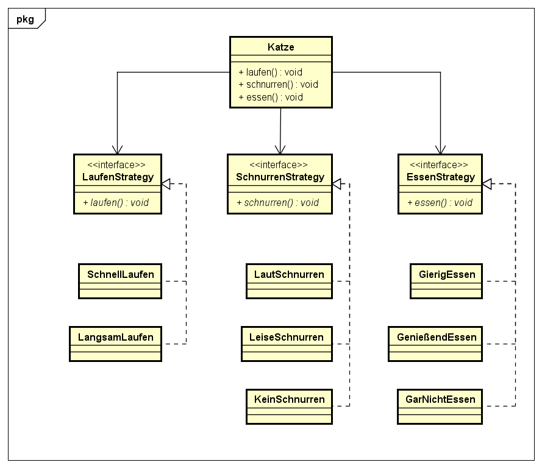

[[Zurück zur Startseite](../Readme.md)]

# Strategy Pattern

### Was ist das Strategy Pattern?

Das Strategy-Pattern ermöglicht das Kapseln eines beliebigen Algorithmus
in einer Klasse, sodass dies zur Laufzeit dynamisch geladen werden
kann.

Nehmen wir uns hierfür als Beispiel eine Katze, Katzen haben vom
Grundprinzip her ähnliches Verhalten und Attribute aber keine ist wie
die andere. Zum Beispiel haben wir 3 Katzen, alle drei davon können laufen
aber nur 2 davon schnell laufen. Sie sind vom Grundpinzip gleich aber
haben jeweil andere Eigenschaften.

### Wie funktioniert das Strategy Pattern?
Es wir eine Katze erstellt welche verschiedene Verhaltensarten hat.
Diese Verhaltensarten werden nocheinmal unterteilt und spezifiziert.

### UML


### Code
Zuerst werden Interfaces für die verschiedenen Funktionen der Katze definiert.

```java

public interface LaufenStrategy{
	public void laufen();
}

public interface SchnurrenStrategy{
	public void schnurren();
}

public interface EssenStrategy{
	public void essen();
}
```

Jetzt wird die Katzen Klasse erstellt

```java

public class Katze{

	private LaufStrategy laufStrat;
	private SchnurrenStrategy schnurrStrat;
	private EssenStrategy essenStrat;

	public Katze(LaufStrategy laufStrat, SchnurrenStrategy schnurrStrat,
	EssenStrategy essenStrat){
		this.laufStrat = laufStrat;
		this.schnurrStrat = schnurrStrat;
		this.essenStrat = essenStrat;
	}

	public void laufen(){
		this.laufStrat.laufen();
	}

	public void schnurren(){
		this.schnurrStrat.schnurren();
	}

	public void essen(){
		this.essenStrat.essen();
	}
}
```

Zuletzt kommen die Implementierungen für die Interfaces dran


```java
public class SchnellLaufen implements LaufenStrategy{
	public void laufen(){
	}
}

public class LangsamLaufen implements LaufenStrategy{
	public void laufen(){
	}
}


public class LautSchnurren implements SchnurrenStrategy{
	public void schnurren(){
	}
}

public class LeiseSchnurren implements SchnurrenStrategy{
	public void schnurren(){
	}
}

public class KeinSchnurren implements SchnurrenStrategy{
	public void schnurren(){
	}
}

public class GierigEssen implements EssenStrategy{
	public void essen(){
	}
}

public class GenießendEssen implements EssenStrategy{
	public void essen(){
	}
}

public class GarNichtEssen implements EssenStrategy{
	public void essen(){
	}
}
```

Jetzt können wir eine Klasse KatzeTest erstellen und einige Katzen erzeugen.

```java
public class KatzeTest{
	public static void main(String[] args){
		Katze hausKatze = new Katze(new SchnellLaufen(),new LautSchnurren(), new GenießendEssen());
		Katze streunerKatze = new Katze(new LangsamLaufen(),new LautSchnurren(), new GierigEssen());


		hausKatze.laufen();
		streunerKatze.laufen();

		hausKatze.schnurren();
		streunerKatze.schnurren();

		hausKatze.essen();
		streunerKatze.essen();
	}
}
```